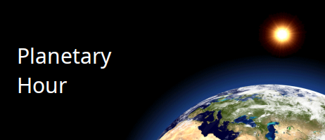

<div align="center" id="top"> 
  

  &#xa0;

<a href="http://www.sounaks.com">Sounak Software</a>
</div>

<h1 align="center">PlanetHour</h1>

<p align="center">
  

  

  

  

  

  

  
</p>

<hr>

<p align="center">
  <a href="#dart-about">About</a> &#xa0; | &#xa0; 
  <a href="#sparkles-features">Features</a> &#xa0; | &#xa0;
  <a href="#shopping_cart-download">Download</a> &#xa0; | &#xa0;
  <a href="#computer-development">Development</a> &#xa0; | &#xa0;
  <a href="#white_check_mark-requirements">Requirements</a> &#xa0; | &#xa0;
  <a href="#checkered_flag-starting">Starting</a> &#xa0; | &#xa0;
  <a href="#memo-license">License</a> &#xa0; | &#xa0;
  <a href="https://github.com/sounak3" target="_blank">Author</a>
</p>

<br>

## :dart: About ##

PlanetHour is a planetary hour calculator for Windows, Linux and macOS. It divides the day (sunrise to sunset) and the night (sunset to the next sunrise) of any place into twelve planetary hours each, ruled by the seven classical planets in Chaldean order, and also shows the Hindu inauspicious periods Rahu Kaalam, Gulika Kaalam and Yamagandam. Sunrise and sunset are calculated from the place's latitude, longitude and time zone, so the hours are correct for wherever you are.

## :sparkles: Features ##

:heavy_check_mark: **`Current Hour at a Glance:`** See the lord of the day, the planetary hour running now and when it ends, the next hour, and whether Rahu, Gulika or Yamagandam is in progress;\
:heavy_check_mark: **`Full Day and Night Table:`** View all 24 planetary hours of the day and night with their start and end times, plus the three special periods;\
:heavy_check_mark: **`Planet Meanings:`** Click any hour in the table to read which activities that planet's hour favours;\
:heavy_check_mark: **`10,900 Places Built In:`** Choose from about 10,900 cities in 185 countries, or add your own places and correct existing ones with their latitude, longitude and time zone;\
:heavy_check_mark: **`Any Date:`** Calculate the planetary hours for any date, past or future;\
:heavy_check_mark: **`System Tray:`** Keep PlanetHour in the system tray; its icon and tooltip show the hour running now and when it ends;\
:heavy_check_mark: **`Display Options:`** Show planet images or astrological symbols, a 12 or 24 hour clock, and a high-contrast black view;\
:heavy_check_mark: **`Remembers Your Choices:`** The selected place, display options and window position are saved for every user, and survive a crash or logoff;

## :shopping_cart: Download ##

In case you want to install the latest release, please download the appropriate OS package and install it. The installers include their own Java runtime:

|  OS  | Download file |
| ---  | ------------- |
| Windows | [PlanetHour-2.0.msi](https://github.com/sounak3/planethour/releases/latest/download/PlanetHour-2.0.msi) |
| Ubuntu / Debian | [planethour_2.0-release_amd64.deb](https://github.com/sounak3/planethour/releases/latest/download/planethour_2.0-release_amd64.deb) |
| Mac OS (Intel; runs on Apple Silicon through Rosetta) | [PlanetHour-2.0.dmg](https://github.com/sounak3/planethour/releases/latest/download/PlanetHour-2.0.dmg) |

In case you're cloning this repository:
```bash
# Clone this project
$ git clone https://github.com/sounak3/planethour

```

## :computer: Development ##

The following tools were used in this project for development:

<a href="https://git-scm.com/" target="_blank"></a> &nbsp; <a href="https://openjdk.org/" target="_blank"></a> &nbsp; <a href="https://maven.apache.org/index.html" target="_blank"></a> &nbsp; <a href="https://netbeans.apache.org/" target="_blank"></a> &nbsp; <a href="https://code.visualstudio.com/" target="_blank"></a> &nbsp; <a href="https://www.jenkins.io/" target="_blank"></a>

The window layouts are edited with the NetBeans GUI builder (`*.form` files next to the Java sources). How the installers are built and tested with Jenkins is described in [BUILD.md](BUILD.md).

## :white_check_mark: Requirements ##

Before starting :checkered_flag: :
- Need to have either of Windows / Linux / MacOS GUI desktop environment.

In case you're cloning this repository and running :
- Need to have [Git](https://git-scm.com), [Java SDK 21](https://openjdk.org/install/) or newer, and [Maven](https://maven.apache.org/download.cgi) installed.

## :checkered_flag: Starting ##

In case you've installed from releases:
- Ubuntu  &emsp;: Click Main/Start Menu --> Utility sub-menu --> PlanetHour
- Windows &emsp;: Click Start menu --> PlanetHour
- Mac OS  &emsp;: Launchpad --> PlanetHour

In case you're cloning this repository and running:
```bash
# Go to cloned directory
$ cd planethour

# Build the project and run its tests
$ mvn clean verify

# Run the project
$ java -jar target/planethour.jar

```

PlanetHour keeps your settings and places in `~/.planethour/` (`%USERPROFILE%\.planethour\` on Windows), so it can be started from any folder.

## :memo: License ##

This project is under the GNU General Public License v3 or later. For more details, see the [LICENSE](LICENSE) file.


Made with :heart: by <a href="https://github.com/sounak3" target="_blank">Sounak Choudhury</a>

&#xa0;

<a href="#top">Back to top</a>
